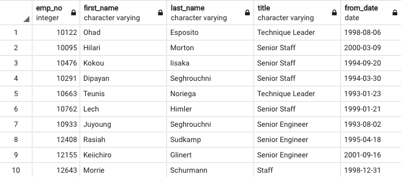

# Brief Project Summary
The number of employees that are eligible for retirement is staggering. The company faces the possibility of losing a great deal of industry knowledge if it cannot find a way to pass along some of this knowledge to the younger employees.  

To address this concern, the HR department has approved a Data Analytics project to identify the employees that are eligible to retire and a list of current employees that could be possible mentorees.

# Updated ERD

# Code for Requested Queries and Examples of Each Output
## Part One
### Number of Titles Retiring
-- List of retirement-eligible employees from Sales and Development
SELECT de.dept_no, ri.emp_no, ri.first_name, ri.last_name
INTO retirement_mentors
FROM retirement_info AS ri
INNER JOIN dept_emp as de
	ON (ri.emp_no = de.emp_no)
WHERE (de.dept_no = 'd007')
	OR (de.dept_no ='d005')

-- List of retirement-eligible employees from Sales and Development
SELECT rm.emp_no, rm.first_name, rm.last_name, t.title, t.from_date, s.salary
INTO challenge_part1
FROM retirement_mentors AS rm
INNER JOIN titles as t
	ON (rm.emp_no = t.emp_no)
INNER JOIN salaries as s
	ON (rm.emp_no = s.emp_no)

### Remove duplicate names
-- Excluding rows of data that contain duplicate names
SELECT DISTINCT ON (first_name, last_name) *
INTO challenge_part1nodup
FROM challenge_part1

### Counting by the most recent titles
-- List the frequency count of employee titles
SELECT COUNT(title), from_date
INTO challenge_p1titlecount
FROM challenge_part1nodup
GROUP BY from_date
ORDER BY from_date

### Identifying current employees who would be good mentorees.
-- Create a new table that contains emp #, name, title and from/to date of current employees ready for a mentor
SELECT e.emp_no, e.first_name, e.last_name, t.title, t.from_date
INTO challenge_p1mentorready
FROM employees as e
INNER JOIN titles as t
	ON (e.emp_no = t.emp_no)
WHERE (e.birth_date BETWEEN '1965-01-01' AND '1965-12-31')
	AND (t.to_date = '9999-01-01');

